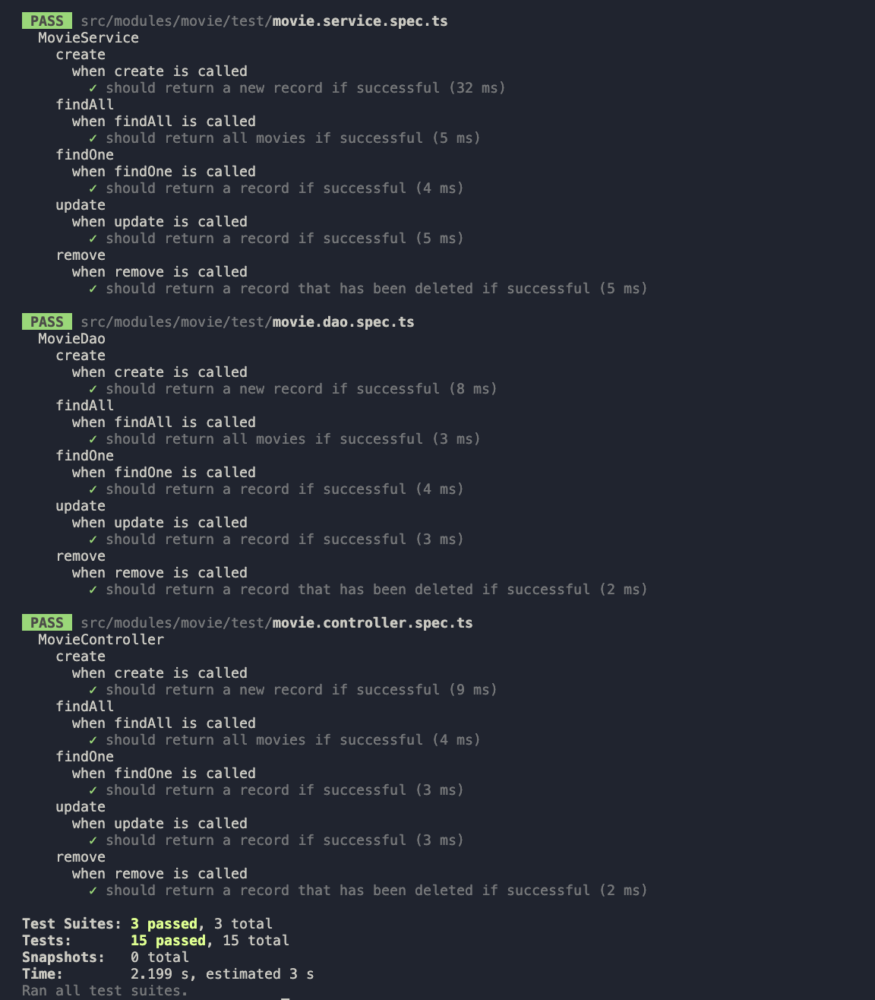
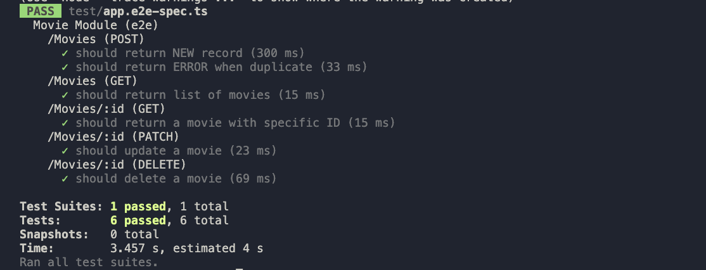

# Movies Service

# Objective

RESTFull Specifications

1. The API must comply RESTFull guideline
2. Free to improvise or create your own API response object
3. Have to use the given endpoints and follow the requirements
4. Create API use Any Programing Language
5. Store data use Postgre or MySQL database
6. Applied request validation
7. Provide unit test on your project
8. Provide the proper README
9. Adding extras like (but not limited to) fancy architectural and elegant error handling.

Movie Table :

| Field       | Type     | Example                                |
| ----------- | -------- | -------------------------------------- |
| id          | Integer  | 1                                      |
| title       | String   | Pengabdi Setan 2 Comunion              |
| description | String   | Adalah film horor indonesia tahun 2022 |
| rating      | Float    | 7.0                                    |
| image       | String   | ''                                     |
| created_at  | Datetime | 2022-08-01 10:56:31                    |
| updated_at  | Datetime | 2022-08-13 09:30:23                    |

RESTFull API List :

1. List of Movie (GET)
   `/Movies`
2. Add New Movie (POST)
   `/Movies`
3. Detail Movie (GET)
   `/Movies/:ID`
4. Update Movie (PATCH)
   `/Movies/:ID`
5. Delete Movie (DELETE)
   `/Movies/:ID`

# Prerequisites

## Tools

1. NodeJS
2. Mysql
3. Postman

# Project Setup

1. Clone this repo.
2. Go to the root project directories
3. Install the packages
   `npm i`
4. clone .env.example file and fill with your credentials
5. Run prisma orm migration
   `npx prisma migrate dev --name init`

# Testing

## Unit Test

1. Type this command
   `npm run test`
   This command will run the unit test.
2. Output :

- 

## Integration Test / E2E Test

1. Type this command
   `npm run test:e2e`
   This command will run the integration test.
2. Output :

- 

# REST API Documentation

1. Go do `docs/api` directory and download the postman file
2. Import the postman file doc to your postman

## Author

- [@fgprayogo](https://www.github.com/fgprayogo)
